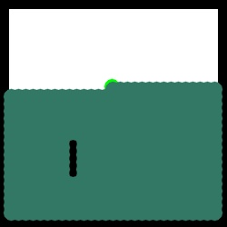

# Planning Algorithms Visualized through OpenCV and UI with tkinter

View planning on Trello board [here](https://trello.com/b/A9lTAano/planningtkinter).

This is a pet project that will help you visualize the 
various search algorithms.

Search Algorithms implemented so far :

 - Breadth First Search Algorithm
   

  

 - Depth First Search Algorithm
   

  

 - Dijkstra's Search Algorithm
   

  

 - A * Search Algorithm

  

## How to run the program

Make sure all the installations are complete. These include:

- OpenCV
- Tkinter
- Numpy

Once done, you can execute the programs in two different ways:

1) Run each path planning separately.
   
2) Run the menu, which will allow you to choose which planning algorithm to run

### Case 1

- Run the individual planning files
- Left click to set the start node. **This Node is indicated in Red**
- Right click to set the goal node. **This Node is indicated in Green**
- Wait for the execution 

### Case 2

- Run the *all_path_planning.py* file
- Left click to set the start node. **This Node is indicated in Red**
- Right click to set the goal node. **This Node is indicated in Green**
- Choose the desired planning algorithm from the menu that pops up
- Wait for the execution 
- Hit *Exit* when done.

 